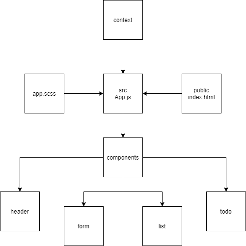

# todo-app

## LAB - 31

### Author: Ibrahem Sarayrah

### LINKS

* LAB - 31 pull request : [https://github.com/IbrahemSarayrah/todo-app/pull/1](https://github.com/IbrahemSarayrah/todo-app/pull/1)

* LAB - 31 [codesandbox.io deployment code](https://codesandbox.io/s/aged-shadow-elr1f?file=/src/app.js)

* LAB - 31 [codesandbox.io deployment link](https://elr1f.csb.app/)

## LAB - 32

* LAB - 32 pull request : [https://github.com/IbrahemSarayrah/todo-app/pull/3](https://github.com/IbrahemSarayrah/todo-app/pull/3)

* LAB - 32 [codesandbox.io deployment code](https://codesandbox.io/s/gallant-archimedes-c43f9)

* LAB - 32 [codesandbox.io deployment link](https://c43f9.csb.app/)

## LAB - 33

* LAB - 33 pull request : [https://github.com/IbrahemSarayrah/todo-app/pull/5](https://github.com/IbrahemSarayrah/todo-app/pull/5)

* LAB - 33 [codesandbox.io deployment code](https://codesandbox.io/s/competent-neumann-cdmb4)

* LAB - 33 [codesandbox.io deployment link](https://cdmb4.csb.app/)

## LAB - 34

### Authors: Ibrahem Sarayrah , Eman Mkhareez , Osama Baker

* LAB - 33 pull request : [https://github.com/IbrahemSarayrah/todo-app/pull/5](https://github.com/IbrahemSarayrah/todo-app/pull/5)

* LAB - 33 [codesandbox.io deployment code](https://codesandbox.io/s/competent-neumann-cdmb4)

* LAB - 33 [codesandbox.io deployment link](https://cdmb4.csb.app/)

### Running the app

>
> npm start
>

#### UML

